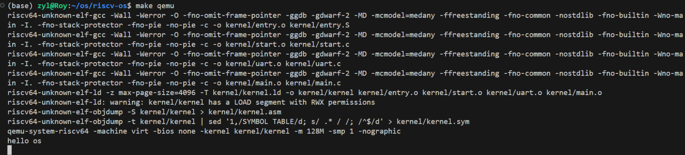

## 实验设计部分
### 架构设计说明
内存部分的实现重点在于对于物理内存的空间分配，以下是物理内存结构设计：
``` txt
RISC-V 内存布局:
+------------------+ 0xFFFFFFFF
|    设备内存       |
+------------------+ 0x10000000  
|      ...         |
+------------------+ 0x80000000  ← 内核加载地址
|   内核代码段      |  
|   .text.init     |  ← _entry 入口点
|   .text          |
|   .data          |
|   .bss           |
+------------------+
|   用户空间        |
+------------------+ 0x00000000
```
内存空间中细分区域的定义如下：
``` txt
- 0x00001000: 启动 ROM（由 QEMU 提供）
- 0x02000000: CLINT（核心本地中断器）
- 0x0C000000: PLIC（平台级中断控制器）
- 0x10000000: UART0（串口）
- 0x10001000: virtio 磁盘
- 0x80000000: 内核加载地址，**包含内核代码和数据**
```

uart部分实现的重点在于缓冲区的设置和交互，因为还未实现中断机制，所以采用轮询这种比较简单的机制，其中核心的操作就是位置复用。
```
#define RHR 0 // receive holding register (for input bytes)
#define THR 0 // transmit holding register (for output bytes)
```
### 关键数据结构
本次实验未涉及复杂数据结构，在处理内存分配时可将其视为数组操作。
### 与xv6对比分析
本实验参考xv6关于内存布局的设计，实际上，这也是非常经典的riscv内存布局，同时因为其他机制暂未实现，所以uart较xv6实现更加简单，在后面的实验中可能会需要参考xv6的中断机制去进行完善。
### 设计决策理由
本次实验可以归结为实现一个操作系统的启动部分，同时为了能够输出，所以需要同时实现串口uart。所以本次重点实现的部分是：内存结构设置链接文件kernel.ld，初始化汇编代码entry.S，支持输出的串口程序uart.c，以及整个操作系统核心的main.c。同时由于操作系统其他部件的缺失，像uart相关的交互机制只能采用简单的单FIFO轮询机制。
## 实验过程部分
### 实验步骤记录
- 首先是参考xv6，编写了kernel.ld这个定义内存布局的文件。
- 之后编写entry.S该汇编文件，完成基础的寄存器设置并跳转到main.c。
- main.c中应该执行初始化完成的输出，所以需要进一步实现uart驱动。
- 编写uart前，需要与现在内存中划分好各部分的空间，为uart预留FIFO空间。
- uart编写时将读写映射到同一地址。
- 运行并检查错误。
### 源码总结与理解
以下是目前的项目架构：
``` txt
├── Makefile
├── compile_commands.json
└── kernel
    ├── defs.h
    ├── entry.S
    ├── kernel.ld
    ├── main.c
    ├── memlayout.h
    ├── riscv.h
    ├── start.c
    ├── types.h
    └── uart.c
```
各部分的具体介绍如下：
#### `defs.h`
- **功能**: 函数声明和全局定义
- **作用**: 声明内核中各模块的公共函数接口，如`uartinit()`, `uart_putc()`等
#### `memlayout.h`
- **功能**: 内存布局定义
- **作用**: 定义物理内存地址映射，如UART控制器地址`UART0 0x10000000L`
#### `riscv.h`
- **功能**: RISC-V架构相关定义
- **作用**: 包含RISC-V特定的寄存器定义、指令宏和系统调用接口
#### `types.h`
- **功能**: 基础数据类型定义
- **作用**: 定义内核使用的基本数据类型，如`char`, `int`, `uint64`等
#### `entry.S`
- **功能**: 内核入口点汇编代码
- **作用**: 系统启动时的第一段代码，负责硬件初始化和跳转到C代码
#### `kernel.ld`
- **功能**: 链接器脚本
- **作用**: 定义内核在内存中的布局，指定代码段、数据段的加载地址
#### `main.c`
- **功能**: 内核主函数
- **作用**: 包含`main()`函数，是内核的C语言入口点，负责初始化各个子系统
#### `start.c`
- **功能**: 启动初始化代码
- **作用**: 处理从汇编代码到main函数之间的初始化工作
#### `uart.c`
- **功能**: UART串口驱动
- **作用**: 实现16550A UART控制器的底层驱动，提供串口输入输出功能
## 测试验证部分
### 功能测试结果
正常执行操作系统初始化并正确输出“hello os”。
### 性能数据
实现操作系统启动的最小子集。
### 运行截图

 为避免截图丢失，以下为复制的文本：
```
zyl@Roy:~/os/riscv-os$ make qemu
riscv64-unknown-elf-gcc -Wall -Werror -O -fno-omit-frame-pointer -ggdb -gdwarf-2 -MD -mcmodel=medany -ffreestanding -fno-common -nostdlib -fno-builtin -Wno-main -I. -fno-stack-protector -fno-pie -no-pie -c -o kernel/entry.o kernel/entry.S
riscv64-unknown-elf-gcc -Wall -Werror -O -fno-omit-frame-pointer -ggdb -gdwarf-2 -MD -mcmodel=medany -ffreestanding -fno-common -nostdlib -fno-builtin -Wno-main -I. -fno-stack-protector -fno-pie -no-pie -c -o kernel/start.o kernel/start.c
riscv64-unknown-elf-gcc -Wall -Werror -O -fno-omit-frame-pointer -ggdb -gdwarf-2 -MD -mcmodel=medany -ffreestanding -fno-common -nostdlib -fno-builtin -Wno-main -I. -fno-stack-protector -fno-pie -no-pie -c -o kernel/uart.o kernel/uart.c
riscv64-unknown-elf-gcc -Wall -Werror -O -fno-omit-frame-pointer -ggdb -gdwarf-2 -MD -mcmodel=medany -ffreestanding -fno-common -nostdlib -fno-builtin -Wno-main -I. -fno-stack-protector -fno-pie -no-pie -c -o kernel/main.o kernel/main.c
riscv64-unknown-elf-ld -z max-page-size=4096 -T kernel/kernel.ld -o kernel/kernel kernel/entry.o kernel/start.o kernel/uart.o kernel/main.o 
riscv64-unknown-elf-ld: warning: kernel/kernel has a LOAD segment with RWX permissions
riscv64-unknown-elf-objdump -S kernel/kernel > kernel/kernel.asm
riscv64-unknown-elf-objdump -t kernel/kernel | sed '1,/SYMBOL TABLE/d; s/ .* / /; /^$/d' > kernel/kernel.sym
qemu-system-riscv64 -machine virt -bios none -kernel kernel/kernel -m 128M -smp 1 -nographic
hello os
```