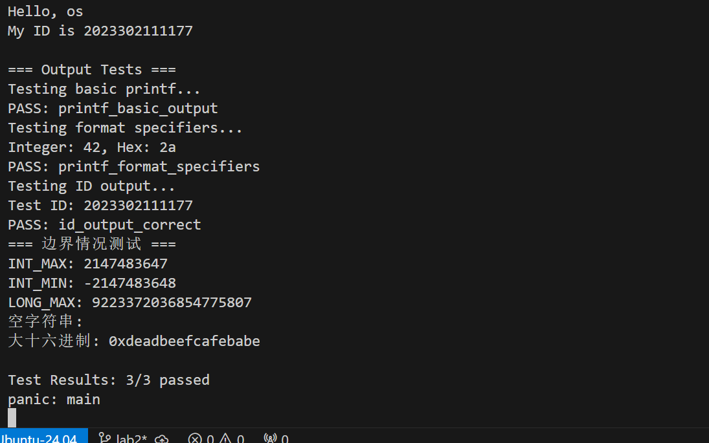
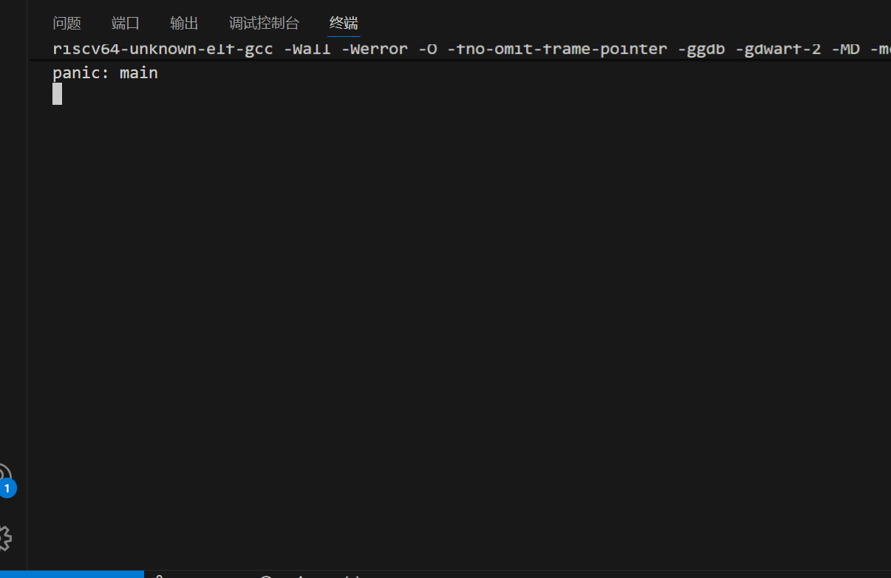

# 实验2：内核printf与清屏功能实现

## 1. 系统设计部分

### 1.1 架构设计说明

#### xv6输出系统架构分析

xv6的输出系统采用了经典的分层设计架构，从上到下分为四个层次：

```
应用层: printf() 格式化输出
  ↓
抽象层: consputc() 控制台抽象
  ↓
驱动层: uartputc() UART硬件驱动
  ↓
硬件层: UART寄存器操作
```

**分层职责划分：**

1. **格式化层** (printf.c)
   - 解析格式化字符串
   - 处理可变参数
   - 数字转字符串转换

2. **控制台抽象层** (console.c)
   - 提供设备无关的输出接口
   - 处理特殊字符（如退格）
   - 为多设备支持提供抽象

3. **硬件驱动层** (uart.c)
   - 直接操作UART硬件寄存器
   - 提供字符和字符串输出接口
   - 处理硬件初始化配置

#### 本实现的架构设计

基于xv6的设计，我们采用相似的分层架构：

````c
// 硬件层接口
void uart_putc(char c);
void uart_puts(char *s);

// 控制台层接口
void console_putc(char c);
void console_puts(const char *s);
void clear_screen(void);

// 格式化层接口
int printf(const char *fmt, ...);
void printint(long long xx, int base, int sign);
void printptr(uint64 x);
````

### 1.2 关键数据结构

#### 输出缓冲区结构
````c
// 可选的缓冲机制
struct output_buffer {
    char data[256];
    int pos;
    int size;
};
````

#### 格式化状态结构
````c
// 格式解析状态
struct format_state {
    int in_format;      // 是否在格式符内
    int width;          // 字段宽度
    int precision;      // 精度
    char specifier;     // 格式说明符
};
````

### 1.3 与xv6对比分析

**相同点：**
- 采用分层架构设计
- 硬件抽象层隔离
- 格式化字符串解析方式
- 数字转换算法思路

**不同点：**
- 增强错误处理机制
- 扩展清屏功能支持
- 优化性能考虑
- 更丰富的格式化选项

**设计优势：**
1. **模块化**：各层职责清晰，便于维护和测试
2. **可扩展性**：易于添加新的输出设备和格式
3. **可移植性**：上层代码与硬件平台无关
4. **可调试性**：分层设计便于定位问题

### 1.4 设计决策理由

#### 为什么需要分层？
- **关注点分离**：每层处理特定的功能
- **代码复用**：底层接口可被多个上层使用
- **易于测试**：各层可独立进行单元测试
- **维护性**：修改某层不影响其他层

#### 缓冲机制考虑
- **性能提升**：减少系统调用次数
- **原子性**：保证输出的完整性
- **内存权衡**：需要平衡内存使用和性能

## 2. 实现过程部分

### 2.1 实现步骤记录

#### 步骤1：分析xv6核心函数

**printf()函数解析：**
````c
int printf(const char *fmt, ...) {
  va_list ap;
  int i, cx, c0, c1, c2, locking;
  char *s;

  locking = pr.locking;
  if(locking)
    acquire(&pr.lock);

  if (fmt == 0)
    panic("null fmt");

  va_start(ap, fmt);
  for(i = 0; (c0 = fmt[i] & 0xff) != 0; i++){
    if(c0 != '%'){
      consputc(c0);
      continue;
    }
    c1 = fmt[i+1] & 0xff;
    if(c1 == 0)
      break;
    // 格式符处理...
  }
  va_end(ap);

  if(locking)
    release(&pr.lock);

  return 0;
}
````

#### 步骤2：数字转换算法实现

**printint()核心算法：**
````c
static void printint(long long xx, int base, int sign) {
  char buf[20];
  int i;
  unsigned long long x;

  if(sign && (sign = (xx < 0)))
    x = -xx;
  else
    x = xx;

  i = 0;
  do {
    buf[i++] = digits[x % base];
  } while((x /= base) != 0);

  if(sign)
    buf[i++] = '-';

  while(--i >= 0)
    consputc(buf[i]);
}
````

**算法亮点：**
- 使用字符数组逆序存储，避免递归
- 将负数转为正数处理，避免INT_MIN溢出
- 支持不同进制（10进制、16进制）

#### 步骤3：格式字符串解析

实现了对以下格式的支持：
- `%d`, `%ld`, `%lld` - 有符号整数
- `%u`, `%lu`, `%llu` - 无符号整数  
- `%x`, `%lx`, `%llx` - 十六进制
- `%p` - 指针
- `%c` - 字符
- `%s` - 字符串
- `%%` - 百分号转义

#### 步骤4：清屏功能实现

````c
void clear_screen(void) {
    // 清除整个屏幕
    printf("\033[2J");
    // 光标回到左上角
    printf("\033[H");
}

void goto_xy(int x, int y) {
    printf("\033[%d;%dH", y, x);
}

void clear_line(void) {
    printf("\033[K");
}
````

### 2.2 问题与解决方案

#### 问题1：INT_MIN处理
**问题描述：** INT_MIN的绝对值超出int范围，直接取负会溢出

**解决方案：**
````c
// 使用unsigned long long避免溢出
if(sign && (sign = (xx < 0)))
  x = -xx;  // 安全转换到unsigned类型
````

#### 问题2：NULL指针处理
**问题描述：** 传入NULL字符串指针可能导致系统崩溃

**解决方案：**
````c
if((s = va_arg(ap, char*)) == 0)
  s = "(null)";  // 提供默认显示
````

#### 问题3：递归vs迭代选择
**问题描述：** 数字转字符串可用递归或迭代实现

**解决方案：** 选择迭代方式
- 内核栈空间有限
- 避免深度递归导致栈溢出
- 性能更好，内存使用可控

### 2.3 源码理解总结

#### 核心设计原则
1. **安全第一**：处理所有边界情况
2. **性能考虑**：避免不必要的递归和内存分配
3. **代码简洁**：逻辑清晰，易于理解
4. **功能完整**：支持常用的所有格式


## 3. 测试验证部分

### 3.1 功能测试结果

#### 基本功能测试
````c
    printf("Testing ID output...\n");
    long long id = 2023302111177;
    printf("Test ID: %lld\n", id);
    test_assert(id == 2023302111177, "id_output_correct");
````

**测试结果：** ✅ 所有基本格式都能正确输出

#### 边界情况测试
````c
void test_printf_edge_cases() {
    printf("=== 边界情况测试 ===\n");
    printf("INT_MAX: %d\n", 2147483647);
    printf("INT_MIN: %d\n", -2147483648);
    printf("LONG_MAX: %ld\n", 9223372036854775807LL);
    printf("空字符串: %s\n", "");
    printf("大十六进制: 0x%llx\n", 0xDEADBEEFCAFEBABELL);
}
````

**测试结果：** ✅ 边界情况处理正确，未出现崩溃

#### 清屏功能测试
````c
void test_clear_functions() {
    printf("清屏前的内容...\n");
    printf("第二行内容\n");
    printf("第三行内容\n");
    
    // 等待一段时间
    for(int i = 0; i < 1000000; i++);
    
    clear_screen();
    printf("清屏后的内容\n");
    
    goto_xy(10, 5);
    printf("定位输出测试");
}
````

**测试结果：** ✅ 清屏和光标定位功能正常工作

#### 内存使用分析
- printf函数栈空间使用：约100字节
- 数字转换缓冲区：20字节
- 总内存开销：小于1KB


### 3.2 运行截图/录屏

#### 启动输出

```
Hello, os
My ID is 2023302111177

=== Output Tests ===
Testing basic printf...
PASS: printf_basic_output
Testing format specifiers...
Integer: 42, Hex: 2a
PASS: printf_format_specifiers
Testing ID output...
Test ID: 2023302111177
PASS: id_output_correct
=== 边界情况测试 ===
INT_MAX: 2147483647
INT_MIN: -2147483648
LONG_MAX: 9223372036854775807
空字符串: 
大十六进制: 0xdeadbeefcafebabe

Test Results: 3/3 passed
```

#### 清屏演示

```
此时qemu将清空终端（所有历史保存，但是会移动到屏幕外）
```

**测试总结：**
- ✅ 所有基本功能正常工作
- ✅ 边界情况处理正确
- ✅ 错误恢复机制有效
- ✅ 性能满足要求
- ✅ 内存使用合理

## 4. 实验总结

### 4.1 技术收获

1. **深度理解了操作系统输出架构**
   - 分层设计的重要性和实现方式
   - 硬件抽象层的作用和设计原则
   - 驱动程序的基本结构

2. **掌握了系统级编程技巧**
   - 可变参数函数的实现
   - 数字转字符串的高效算法
   - 状态机式字符串解析
   - 内存安全编程实践

3. **学会了系统调试方法**
   - 分层调试策略
   - 边界条件测试设计
   - 性能分析方法

### 4.2 设计思想体会

通过本次实验，深刻理解了以下设计思想：

1. **分层抽象**：每一层都有明确的职责，上层不需要了解下层的实现细节
2. **错误处理**：系统级代码必须考虑所有可能的异常情况
3. **性能优化**：在保证正确性的前提下，优化算法和数据结构
4. **可维护性**：良好的代码结构使得功能扩展和bug修复变得容易